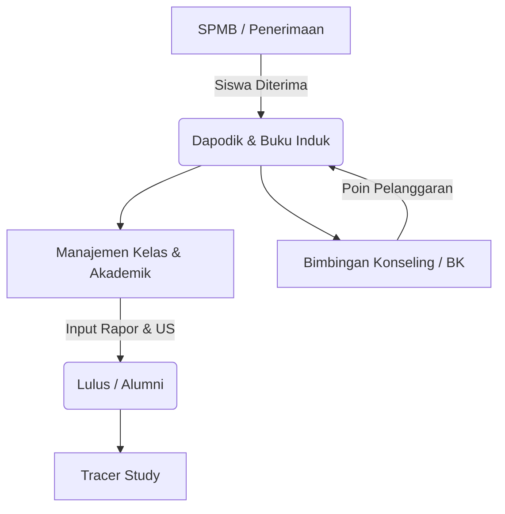

# LAPORAN ANALISIS KONSEP & IMPLEMENTASI SISTEM SINTA-SaaS
*Dokumentasi Konseptual Sistem Inti Akademik & Dapodik/SPMB (Multi-Tenant)*

---

## 1. PENDAHULUAN

**SINTA-SaaS** (*Sistem Inti Akademik & Dapodik/SPMB*) adalah aplikasi *Software as a Service* (SaaS) berbasis **Multi-Tenant** yang mengintegrasikan seluruh ekosistem data sekolah: hulu (Penerimaan Siswa Baru / SPMB), proses (Dapodik, Akademik, Bimbingan Konseling), hingga hilir (Tracer Study & Alumni) ke dalam satu platform tunggal. 

Laporan ini disusun untuk memberikan gambaran komprehensif mengenai konsep arsitektur, modul-modul fungsional, dan penyempurnaan terbaru (termasuk *Dynamic Curriculum Engine*, Kunci Nilai Rapor, dan Ujian Sekolah) yang telah berjalan di dalam sistem tanpa melakukan perubahan kode program.

---

## 2. ARSITEKTUR UTAMA & SISTEM INTI (CORE SYSTEM)

SINTA-SaaS dibangun di atas pilar-pilar arsitektur modern yang menjamin keamanan data, kecepatan aplikasi, dan keberlanjutan jangka panjang.

### 2.1 Isolasi Data Multi-Tenant (Shared Schema)
Sistem ini menggunakan satu basis data bersama (*Shared Schema*), namun memisahkan data antar institusi (sekolah) secara ketat melalui mekanisme **Isolasi Logikal**:
* **Kunci Isolasi (`tenant_id`):** Setiap query ke database (SELECT, INSERT, UPDATE, DELETE) secara otomatis menyertakan parameter `tenant_id` berdasarkan session operator yang aktif (contoh: `WHERE tenant_id = $_SESSION['tenant_id']`).
* **UUIDv4 (Universally Unique Identifier):** ID untuk entitas penting (seperti `users`, `siswa`, `tenants`) menggunakan UUIDv4 dan bukan auto-increment integer biasa. Hal ini mencegah serangan keamanan berbasis *Insecure Direct Object Reference* (IDOR) di mana peretas mencoba menerka ID pengguna lain.
* **Gatekeeper Middleware:** Middleware keamanan mencegat setiap request. Jika status tenant suatu sekolah dinonaktifkan (`Suspended` atau `Inactive`) oleh Super Admin, sistem secara instan memblokir login atau memutus paksa sesi aktif (*force logout*) seluruh pengguna dari sekolah tersebut.

### 2.2 Antarmuka Hybrid SPA (Turbo Drive & Vue Lifecycle)
Untuk memberikan pengalaman pengguna yang cepat dan mulus tanpa jeda pemuatan halaman (*page reload*), SINTA-SaaS menggabungkan kinerja PHP Server-Side dengan rasa Single Page Application (SPA):
* **Turbo Drive:** Mencegat klik navigasi dan submit form, mengambil HTML baru di latar belakang, lalu mengganti elemen `<body>` secara asinkron.
* **Manajemen Memori:** Untuk menghindari kebocoran memori (*memory leaks*) akibat penumpukan instance Javascript, sistem menggunakan event listener `turbo:before-cache` untuk menghancurkan (*destroy*) objek Vue atau kalender dinamis sebelum transisi halaman selesai.

### 2.3 Keamanan Berkas Terisolasi & Auto-Clean
* **Isolasi File Direktori:** File sensitif seperti Ijazah, Akta Kelahiran, dan Pasfoto disimpan di path terfragmentasi: `/storage/uploads/{tenant_id}/{siswa_id}/` dengan nama file yang di-hash.
* **Karantina Eksekusi (Anti-Webshell):** Web server Nginx dikonfigurasi secara ketat untuk menonaktifkan interpretasi skrip PHP di dalam folder unggahan (`uploads`). Jika peretas berhasil mengunggah file `shell.php`, server hanya akan merendernya sebagai teks biasa tanpa mengeksekusinya.
* **Auto-Delete Orphan Files:** Saat pengguna memperbarui berkas (misal mengganti pasfoto), backend mendeteksi referensi file lama dan menghapusnya secara fisik dari disk server sebelum menyimpan file baru. Hal ini mencegah pemborosan ruang penyimpanan disk (*disk bloating*).

---

## 3. MODUL FUNGSIONAL & ALUR LOGIKA BISNIS

Sistem SINTA-SaaS mengintegrasikan berbagai modul fungsional yang dirancang secara modular dan saling terhubung:

### 3.1 Pendaftaran & Data Pokok Siswa (Wizard Form)
Formulir kependudukan yang sangat kompleks (sesuai standar Dapodik) dipermudah menggunakan **Multi-Step Wizard** 5 Tahap (Biodata, Alamat/Kontak, Fisik/Kesejahteraan, Orang Tua/Wali, Registrasi Dokumen):
* **Validasi Lokal:** Validasi form dilakukan secara dinamis di tingkat browser (DOM) selama perpindahan langkah 1 s.d 4. Pengiriman data ke server hanya dilakukan satu kali (*Single Submit*) pada langkah ke-5 untuk mengurangi latensi jaringan.
* **Logika Kondisional (KIP/PIP):** Kolom input nomor KIP/PIP otomatis bersifat *required* (wajib diisi) di tingkat DOM jika pengguna memilih "YA" pada opsi penerima PIP.
* **Integritas Database (Atomic Transaction):** Penyimpanan data yang tersebar di 8 tabel relasional dibungkus dalam transaksi database (`DB::beginTransaction()`). Jika salah satu tabel gagal ditulis, sistem otomatis melakukan rollback total untuk menghindari data korup.

### 3.2 Bimbingan Konseling (BK) & Buku Sanksi
Pencatatan pelanggaran siswa diintegrasikan dengan modul poin pelanggaran kuantitatif:
* Sistem secara otomatis menjumlahkan (`SUM`) poin pelanggaran siswa secara real-time.
* Penerapan batas poin (*threshold*) otomatis:
  * **&ge; 25 Poin:** Peringatan visual (Kuning).
  * **&ge; 50 Poin:** Surat Panggilan Orang Tua 1 (SP 1).
  * **&ge; 75 Poin:** Surat Panggilan Orang Tua 2 (SP 2 - Skorsing).
  * **&ge; 100 Poin:** Rekomendasi Sidang Pleno / Drop Out (DO).

### 3.3 Penjurusan Mandiri & DSS (Decision Support System) Kelas 10
Membantu penentuan minat bakat dan penjurusan siswa (IPA/IPS/Bahasa) secara objektif:
* **Aktivasi Khusus:** Menu penjurusan hanya dirender untuk siswa kelas 10 dan disembunyikan otomatis saat naik kelas.
* **Formula Penjurusan (DSS):** Menarik data Tes RIASEC (Minat Bakat), skor IQ (Psikotes), dan nilai rata-rata Rapor Kelas 10, lalu mengkalkulasinya secara asinkron.
* **Locking Kuota (Anti-Race Condition):** Menggunakan penguncian SQL `SELECT ... FOR UPDATE` saat pendaftaran jurusan yang hampir penuh untuk mencegah kuota bocor akibat persaingan akses simultan oleh banyak siswa.

### 3.4 Tracer Study & Siklus Alumni
* Saat status siswa diubah menjadi "Lulus", *state machine* sistem mengunci data Buku Induk siswa tersebut secara permanen (*Read-Only*).
* Bersamaan dengan itu, sistem membuka rute API khusus `/api/v1/tracer` di dashboard alumni agar mereka dapat mengisi riwayat kelanjutan studi (Kuliah/Kerja) secara berkala.

---

## 4. DYNAMIC CURRICULUM ENGINE & MANAJEMEN NILAI
*(Penyempurnaan Terakhir pada Modul Buku Induk)*

Berdasarkan rencana implementasi terakhir dan berkas dokumentasi terbaru, sistem Buku Induk telah dimodernisasi agar memiliki **Dynamic Curriculum Engine** yang sangat fleksibel (*Future-Proof*).

### 4.1 Desain Kurikulum Dinamis (Tahan Masa Depan)
Sistem tidak lagi membatasi tipe kurikulum secara statis (*hardcoded*). Melalui tabel `ref_kurikulum`, sekolah dapat mendefinisikan kurikulum kustom mereka sendiri (seperti *Cambridge Curriculum*, *IB*, atau kurikulum lokal pesantren):
* **Nasional vs Kustom:** Kolom `tenant_id` pada `ref_kurikulum` bernilai `NULL` untuk kurikulum standar nasional (KBK, KTSP, K-13, Merdeka) yang tersedia bagi semua sekolah, sedangkan kurikulum kustom sekolah diisi dengan UUID tenant terkait.
* **Tipe Penilaian:** Kurikulum memiliki metadata tipe penilaian (`sederhana`, `klasik`, `kompleks`, `custom`) yang akan mengubah perilaku input nilai dan format rapor secara dinamis.

### 4.2 Penyimpanan Nilai Fleksibel (JSON Payload)
Untuk mendukung perbedaan struktur nilai antar kurikulum tanpa harus mengubah struktur kolom database di masa depan, sistem menggunakan kolom JSON **`nilai_detail_json`** pada tabel `detail_nilai_rapor`:
* **Kurikulum KTSP:** Menyimpan data format `{"kognitif": 85, "psikomotorik": 80, "afektif": "A"}`.
* **Kurikulum 2013:** Menyimpan format `{"pengetahuan_nilai": 82, "pengetahuan_predikat": "B", "pengetahuan_deskripsi": "...", "keterampilan_nilai": 85, "keterampilan_predikat": "A", "keterampilan_deskripsi": "..."}`.
* **Kurikulum Merdeka:** Menyimpan data format `{"deskripsi_tertinggi": "...", "deskripsi_terendah": "..."}`.
* **Kurikulum Kustom (Misal Cambridge):** Menyimpan data format `{"exam_score": 90, "coursework_score": 85, "grade_letter": "A*"}`.

### 4.3 Sistem Penguncian Nilai (Lock Grades) & Audit Log
Untuk menjaga integritas Buku Induk sebagai dokumen negara yang sah dan terlindung dari manipulasi data:
* **Lock Grades:** Admin/Kepala Sekolah dapat mengunci data nilai per Rombongan Belajar (Rombel). Saat dikunci (`is_locked = 1`), backend secara otomatis menolak request penyimpanan (`save`) dan penghapusan (`deleteSiswaGradesApi`) nilai rapor.
* **Audit Log Rapor:** Setiap perubahan data nilai dicatat secara mendalam di tabel `log_nilai_rapor` (mencatat siapa, kapan, mata pelajaran apa, serta data nilai sebelum dan sesudah perubahan untuk keperluan forensik data).

### 4.4 Cetak Rapor Massal & Ekspor PDSS SNBP
* **Bulk Print Rapor:** Menyediakan cetak massal rapor per rombel sekali klik dengan pemisahan halaman otomatis menggunakan CSS `page-break-after: always;` pada template khusus (`print_rapot_bulk_merdeka.php`, `print_rapot_bulk_k13.php`, `print_rapot_bulk_ktsp.php`).
* **Ekspor PDSS SNBP:** Membantu ekspor massal nilai semester 1-5 untuk siswa tingkat akhir (kelas 12) ke format Excel (.xlsx) yang kompatibel 100% dengan portal registrasi seleksi masuk perguruan tinggi nasional (SNBP).

### 4.5 Kalkulasi Ujian Sekolah & Nilai Ijazah (Kelas 12)
Siswa kelas 12 memiliki penanganan khusus untuk penentuan kelulusan dan nilai ijazah:
* **Semester Ujian Sekolah:** Pada dropdown semester kelas 12, sistem secara dinamis memunculkan pilihan semester khusus bernama **"Ujian Sekolah"** tanpa perlu memodifikasi tabel database baru.
* **Perhitungan Nilai Sekolah (NS) / Nilai Ijazah:** Sistem melakukan kalkulasi *on-the-fly* di memori berdasarkan formula bobot kustom sekolah (contoh: 60% Rata-rata Rapor Semester 1-5 + 40% Nilai Ujian Sekolah) untuk mencetak transkrip kelulusan atau lembar belakang ijazah secara otomatis.

---

## 5. KESIMPULAN

SINTA-SaaS menunjukkan tingkat kematangan arsitektur perangkat lunak yang sangat baik dengan menerapkan pola isolasi data multi-tenant yang aman, penanganan antarmuka responsif minim *reload*, serta penyimpanan data nilai yang *future-proof* menggunakan skema JSON dinamis. Seluruh implementasi berjalan selaras dengan regulasi nasional Dapodik dan kebutuhan administrasi operasional sekolah secara komprehensif.
